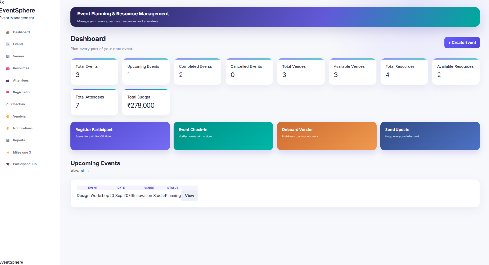
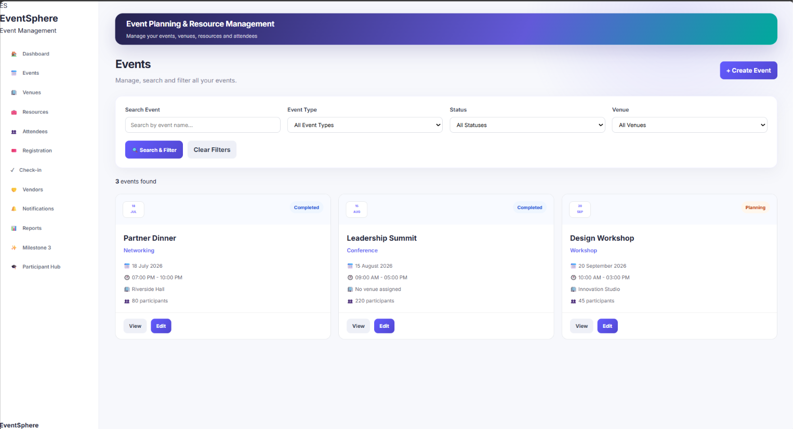
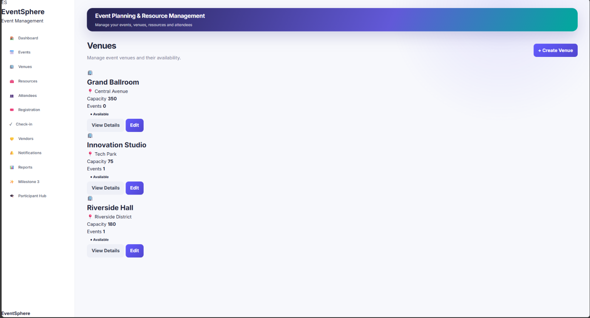
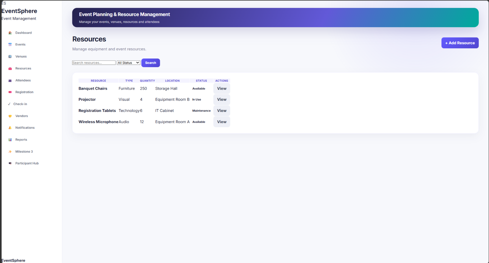

# EventSphere – Event Planning & Resource Management System

A modern full-stack web application built using **Python, Flask, SQLite, SQLAlchemy, HTML, CSS, and JavaScript** to simplify event planning, venue booking, resource allocation, participant management, attendance tracking, and operational analytics.

## Milestone Status

**Current Progress:** ✅ Milestone 4 Completed

---

## Problem Statement

Managing college events through spreadsheets, paper records, and messaging apps often leads to scheduling conflicts, resource shortages, and poor organization.

EventSphere provides a centralized platform that manages the complete event lifecycle from planning to reporting.

---

## Technology Stack

| Technology | Purpose |
|------------|---------|
| Python | Backend |
| Flask | Web Framework |
| SQLite | Database |
| SQLAlchemy | ORM |
| HTML5 | Frontend Structure |
| CSS3 | Styling |
| JavaScript | Client-side Interactions |

---

## Features Completed

### Milestone 1 – Core Management

- Event CRUD (Create, Read, Update, Delete)
- Venue Management
- Venue Capacity Validation
- Venue Scheduling Conflict Detection
- Resource Management
- Resource Allocation & Return
- Participant Registration
- Dashboard Overview
- Budget Foundation

### Milestone 2 – Event Operations

- QR Code Ticket Generation
- Digital Tickets
- Participant Check-in
- Attendance Tracking
- Vendor Management
- Registration Workflow

### Milestone 3 – Smart Operations

- Budget Monitoring
- Expense Tracking
- Sponsorship Tracking
- REST API Foundation
- Notifications & Reminders
- Approval Workflow

### Milestone 4 – Analytics & Optimization

- Analytics Dashboard
- KPI Cards
- Charts & Visual Reports
- Resource Utilization Analysis
- Venue Utilization Analysis
- Budget Analytics
- PDF & CSV Report Export
- Integration Testing
- CI Workflow
- Docker Support
- API Documentation
- Architecture Documentation
- Deployment Guide
- User Guide

---

## Project Workflow

Create Event
↓
Book Venue
↓
Allocate Resources
↓
Register Participants
↓
Generate QR Ticket
↓
Participant Check-in
↓
Attendance Tracking
↓
Budget Monitoring
↓
Analytics & Reports

---

## Project Structure

```text
EventSphere/
│
├── app/
│   ├── static/
│   ├── templates/
│   ├── operations_models.py
│   ├── operations_routes.py
│   └── operations_services.py
│
├── docs/
│   ├── API.md
│   ├── ARCHITECTURE.md
│   ├── DEPLOYMENT.md
│   └── USER_GUIDE.md
│
├── tests/
│
├── .github/
│
├── Dockerfile
├── requirements.txt
└── README.md
```

---

## Application Preview

> Replace these images with your actual screenshots.

### Dashboard



### Events



### Venues



### Resources



### Analytics


### Budget


---

## Installation

Clone the repository:

```bash
git clone https://github.com/mfahad27/EventSphere.git
cd EventSphere
```

Create a virtual environment:

```bash
python -m venv .venv
```

Activate it:

### Windows

```bash
.venv\Scripts\activate
```

Install dependencies:

```bash
pip install -r requirements.txt
```

Run the application:

```bash
python run.py
```

Open your browser:

```
http://127.0.0.1:5000
```

---

## Documentation

The project includes additional documentation inside the `docs/` folder.

- API Documentation
- Architecture Guide
- Deployment Guide
- User Guide

---

## Testing

The project includes integration testing.

Run:

```bash
pytest
```

---

## Future Enhancements

- Email Notifications
- Mobile App
- Cloud Deployment
- Advanced Analytics
- Multi-user Authentication
- Real-time Event Updates

---

## Author

**Mohammed Fahad**

AIML Engineering Student

GitHub: https://github.com/mfahad27