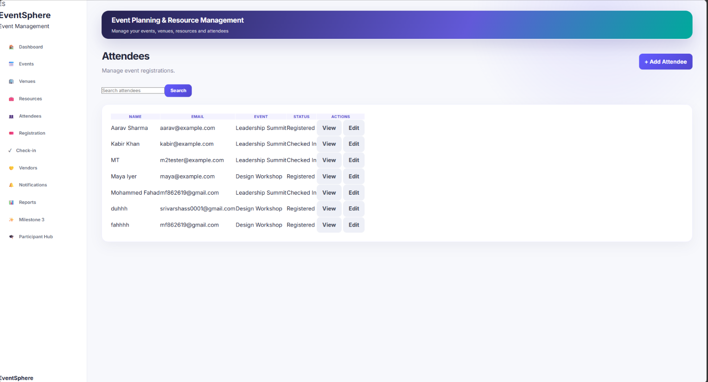
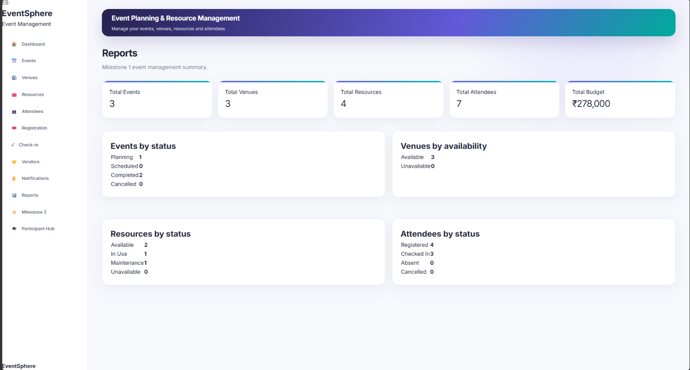

# EventSphere – Event Planning & Resource Management System


A full-stack web application built using **Python, Flask, SQLite, SQLAlchemy, HTML, CSS, and JavaScript** to simplify event planning, venue booking, resource allocation, participant management, vendor management, and attendance tracking.

## Milestone Status

**Current Progress:** Milestone 3 Completed

## Problem Statement

Managing college events manually through spreadsheets, paper records, and messaging apps often leads to scheduling conflicts, resource shortages, and poor organization.

EventSphere provides one centralized platform to manage the complete event workflow.

## Tech Stack

- Python
- Flask
- SQLite
- Flask-SQLAlchemy
- HTML5
- CSS3
- JavaScript

## Features Completed

### Event Management

- Create Event
- View Events
- Edit Events
- Delete Events

### Venue Management

- Add Venues
- Assign Venues
- Capacity Validation
- Scheduling Conflict Detection

### Resource Management

- Add Resources
- Allocate Resources
- Availability Validation
- Resource Return

### Participant Management

- Register Participants
- Prevent Duplicate Registration
- Attendance Tracking

### Budget Management

- Store Budget
- Expense Tracking
- Remaining Budget Calculation

### Reports

- Dashboard Summary
- Event Reports
- Venue Usage
- Resource Usage

## Project Structure

EventSphere/
├── app/
├── instance/
├── run.py
├── requirements.txt
└── README.md

## Installation

```bash
git clone https://github.com/mfahad27/EventSphere.git
cd EventSphere
python -m venv .venv
.venv\Scripts\activate
pip install -r requirements.txt
python run.py
```

## Future Enhancements

- QR Code Ticket Verification
- Email Notifications
- Advanced Analytics
- Mobile-Friendly Improvements
- Export Reports

## Application Preview

### Dashboard


### Events


### Venues


### Resources


### Attendees



### Reports

